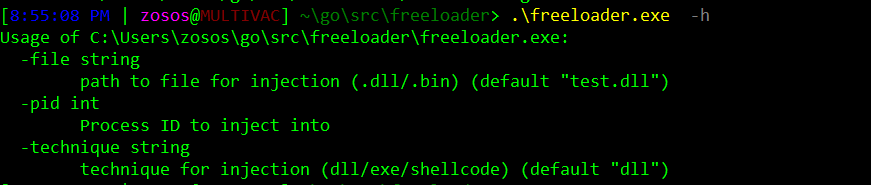

# Freeloader
## General purpose DLL/Shellcode/PE injection utility

### Info:
Tool to experiment with implementing various injection techniques
- currently supports DLLs and PIC shellcode (PE tbd soon)
- eventually would like to add support for reflection as well
- option for local or remote process injection
- not opsec safe - makes use of both CreateRemoteThread and RWX pages in memory

### Background:
I wanted to write something that could handle loading and executing various file types memory. I'm using the raw syscall package (instead of /x/sys/windows) for a change of pace. Primarily using this as a tool for my own educational purposes so ymmv.
I've been using https://github.com/peterferrie/win-exec-calc-shellcode for PoC code and its been wonderful.

### Usage:

#### Arguments:
- **-file**: Source file to be injected into target (can handle both absolute and relative file paths, but use absolute for best results)
- **-pid**: Process ID to use, if not set on command line it defaults to 0 (local process injection)
- **-technique**: Determines the overall injection to be used (dll/shellcode/pe)

### Source(s):
- https://github.com/securestate/syringe
- https://github.com/golang/go/wiki/WindowsDLLs
